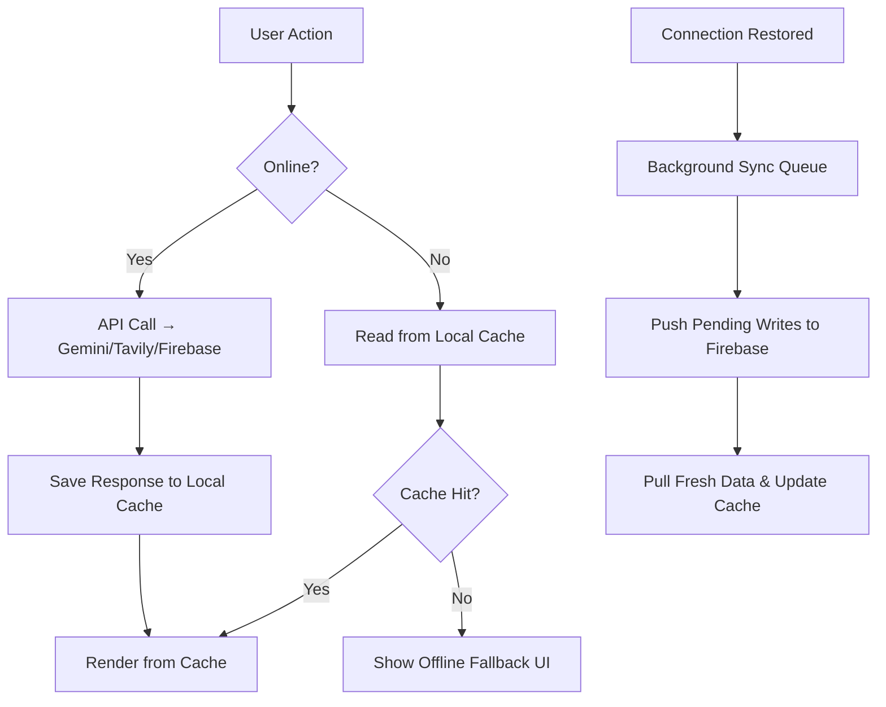

# KisanMitra — Offline-First Implementation Strategy

> An offline-first app works without internet by default, and syncs data when connectivity returns. For Indian farmers with patchy 2G/3G in rural areas, this isn't a luxury — it's a requirement.

---

## Architecture Overview



---

## The 3 Layers You Need

### Layer 1: Service Worker (PWA Shell)
**What it does:** Caches your app's HTML/CSS/JS/images so the app *opens instantly* even offline.

### Layer 2: Data Cache (IndexedDB via `idb` library)
**What it does:** Stores AI responses, market prices, weather data, etc. locally so previously-viewed data is available offline.

### Layer 3: Sync Queue (Background Sync)
**What it does:** Queues writes (new listings, chat messages, orders) when offline and replays them when connectivity returns.

---

## Layer 1: Service Worker (PWA)

### Step 1 — Install `vite-plugin-pwa`

```bash
npm install vite-plugin-pwa -D
```

### Step 2 — Update `vite.config.ts`

```typescript
import { VitePWA } from 'vite-plugin-pwa';

// Add to your plugins array:
VitePWA({
  registerType: 'autoUpdate',
  includeAssets: ['logo.png', 'favicon.ico'],
  manifest: {
    name: 'KisanMitra — Smart Agriculture',
    short_name: 'KisanMitra',
    description: 'AI-powered farming platform for Indian farmers',
    theme_color: '#2D6A4F',
    background_color: '#ffffff',
    display: 'standalone',
    start_url: '/',
    icons: [
      { src: '/logo.png', sizes: '192x192', type: 'image/png' },
      { src: '/logo.png', sizes: '512x512', type: 'image/png' },
    ],
  },
  workbox: {
    // Cache all static assets
    globPatterns: ['**/*.{js,css,html,ico,png,svg,woff2}'],
    // Cache API responses with strategies
    runtimeCaching: [
      {
        // Google Fonts
        urlPattern: /^https:\/\/fonts\.googleapis\.com\/.*/i,
        handler: 'CacheFirst',
        options: { cacheName: 'google-fonts-cache', expiration: { maxEntries: 10, maxAgeSeconds: 365 * 24 * 60 * 60 } },
      },
      {
        // Open-Meteo weather API
        urlPattern: /^https:\/\/api\.open-meteo\.com\/.*/i,
        handler: 'NetworkFirst',
        options: { cacheName: 'weather-cache', expiration: { maxEntries: 20, maxAgeSeconds: 30 * 60 } },
      },
      {
        // Your /api/search proxy
        urlPattern: /\/api\/search/,
        handler: 'NetworkFirst',
        options: { cacheName: 'search-cache', expiration: { maxEntries: 50, maxAgeSeconds: 60 * 60 } },
      },
    ],
  },
})
```

### Step 3 — Register the Service Worker in `index.tsx`

```typescript
import { registerSW } from 'virtual:pwa-register';

const updateSW = registerSW({
  onNeedRefresh() {
    // Show a toast: "New version available, refresh to update"
  },
  onOfflineReady() {
    // Show a toast: "App ready for offline use"
  },
});
```

> [!IMPORTANT]
> This alone makes KisanMitra installable as a mobile app (Add to Home Screen) — huge for farmer adoption.

---

## Layer 2: Local Data Cache with IndexedDB

### Install the `idb` library (tiny, promise-based IndexedDB wrapper)

```bash
npm install idb
```

### Create `services/offlineCache.ts`

```typescript
import { openDB, DBSchema, IDBPDatabase } from 'idb';

interface KisanMitraDB extends DBSchema {
  // AI response caches — keyed by query
  weatherCache: {
    key: string;           // location name
    value: {
      data: any;           // WeatherData
      timestamp: number;
      expiresAt: number;
    };
  };
  marketPriceCache: {
    key: string;           // "crop|location"
    value: {
      data: any;           // CropPricePrediction
      timestamp: number;
      expiresAt: number;
    };
  };
  commodityCache: {
    key: string;           // comma-separated names
    value: {
      data: any[];         // LiveCommodityData[]
      timestamp: number;
      expiresAt: number;
    };
  };
  diseaseReportCache: {
    key: string;           // image hash
    value: { data: any; timestamp: number };
  };
  // Offline write queue
  syncQueue: {
    key: number;           // auto-increment
    value: {
      id?: number;
      action: string;      // 'create_listing' | 'send_message' | 'place_order' etc.
      payload: any;
      createdAt: number;
      status: 'pending' | 'syncing' | 'failed';
      retryCount: number;
    };
    indexes: { 'by-status': string };
  };
  // User's own data for offline access
  userProfile: {
    key: string;           // uid
    value: any;            // FarmerProfile
  };
  myListings: {
    key: string;           // listing id
    value: any;            // ProductListing
  };
}

const DB_NAME = 'kisanmitra-offline';
const DB_VERSION = 1;

let dbPromise: Promise<IDBPDatabase<KisanMitraDB>> | null = null;

function getDB() {
  if (!dbPromise) {
    dbPromise = openDB<KisanMitraDB>(DB_NAME, DB_VERSION, {
      upgrade(db) {
        db.createObjectStore('weatherCache');
        db.createObjectStore('marketPriceCache');
        db.createObjectStore('commodityCache');
        db.createObjectStore('diseaseReportCache');
        
        const syncStore = db.createObjectStore('syncQueue', {
          keyPath: 'id',
          autoIncrement: true,
        });
        syncStore.createIndex('by-status', 'status');
        
        db.createObjectStore('userProfile');
        db.createObjectStore('myListings');
      },
    });
  }
  return dbPromise;
}

// ─── Generic cache helpers ───

export async function getCached<T>(
  store: 'weatherCache' | 'marketPriceCache' | 'commodityCache',
  key: string
): Promise<T | null> {
  const db = await getDB();
  const entry = await db.get(store, key);
  if (!entry) return null;
  if (Date.now() > entry.expiresAt) {
    await db.delete(store, key);
    return null;
  }
  return entry.data as T;
}

export async function setCache(
  store: 'weatherCache' | 'marketPriceCache' | 'commodityCache',
  key: string,
  data: any,
  ttlMs: number = 30 * 60 * 1000  // default 30 min
): Promise<void> {
  const db = await getDB();
  await db.put(store, {
    data,
    timestamp: Date.now(),
    expiresAt: Date.now() + ttlMs,
  }, key);
}

// ─── Sync Queue ───

export async function addToSyncQueue(action: string, payload: any): Promise<void> {
  const db = await getDB();
  await db.add('syncQueue', {
    action,
    payload,
    createdAt: Date.now(),
    status: 'pending',
    retryCount: 0,
  });
}

export async function getPendingSyncItems() {
  const db = await getDB();
  return db.getAllFromIndex('syncQueue', 'by-status', 'pending');
}

export async function removeSyncItem(id: number) {
  const db = await getDB();
  await db.delete('syncQueue', id);
}

export async function markSyncFailed(id: number) {
  const db = await getDB();
  const item = await db.get('syncQueue', id);
  if (item) {
    item.status = 'failed';
    item.retryCount += 1;
    await db.put('syncQueue', item);
  }
}

// ─── Connection status ───

export function isOnline(): boolean {
  return navigator.onLine;
}

export function onConnectionChange(callback: (online: boolean) => void) {
  window.addEventListener('online', () => callback(true));
  window.addEventListener('offline', () => callback(false));
  return () => {
    window.removeEventListener('online', () => callback(true));
    window.removeEventListener('offline', () => callback(false));
  };
}
```

---

## Layer 3: Integration Pattern — "Online-First, Cache-Fallback"

Here's how you'd modify an existing service function. Example with weather:

### Before (current code — online only)
```typescript
export const getWeatherForecast = async (location: string): Promise<WeatherData> => {
    // Fails completely when offline ❌
    const response = await fetch(url);
    ...
};
```

### After (offline-resilient)
```typescript
import { getCached, setCache, isOnline } from './offlineCache';

export const getWeatherForecast = async (location: string): Promise<WeatherData> => {
    const cacheKey = location.trim().toLowerCase();
    
    // 1. If offline, return cached data immediately
    if (!isOnline()) {
        const cached = await getCached<WeatherData>('weatherCache', cacheKey);
        if (cached) return cached;
        throw new Error('You are offline. Weather data will load when connection is restored.');
    }
    
    // 2. If online, fetch fresh data
    try {
        const data = await fetchFromAPI(location); // your existing logic
        
        // 3. Save to IndexedDB for offline use (cache for 1 hour)
        await setCache('weatherCache', cacheKey, data, 60 * 60 * 1000);
        
        return data;
    } catch (error) {
        // 4. Network failed? Fall back to cache
        const cached = await getCached<WeatherData>('weatherCache', cacheKey);
        if (cached) return cached;
        throw error;  // truly no data available
    }
};
```

### Which features to apply this to:

| Feature | Cache Strategy | TTL | Priority |
|---|---|---|---|
| **Weather** | NetworkFirst, cache fallback | 1 hour | 🔴 High |
| **Market Prices** | NetworkFirst, cache fallback | 30 min | 🔴 High |
| **Live Commodities** | NetworkFirst, cache fallback | 5 min | 🔴 High |
| **Disease Detection** | CacheFirst (same image = same result) | Forever | 🟡 Medium |
| **Planting Recs** | NetworkFirst, cache fallback | 24 hours | 🟡 Medium |
| **Agri News** | NetworkFirst, cache fallback | 2 hours | 🟢 Low |
| **Yield Prediction** | NetworkFirst, cache fallback | 24 hours | 🟡 Medium |
| **Marketplace Listings** | Firestore offline persistence (already exists!) | Auto | ✅ Done |
| **Chat Messages** | Firestore offline persistence | Auto | ✅ Done |

> [!TIP]
> Your Firestore already has `enablePersistence()` in `firebase.ts` — so marketplace listings, chat, and user profiles already work offline! The gap is the **AI-powered features** that hit external APIs.

---

## Layer 3b: Sync Queue for Offline Writes

When a farmer creates a listing, sends a message, or places an order while offline:

### Create `services/syncService.ts`

```typescript
import { addToSyncQueue, getPendingSyncItems, removeSyncItem, markSyncFailed } from './offlineCache';
import { isOnline } from './offlineCache';

// Instead of directly calling Firebase, queue the write
export async function offlineAwareWrite(
  action: string,
  writeFn: () => Promise<void>,
  payload: any
): Promise<void> {
  if (isOnline()) {
    try {
      await writeFn();
      return;
    } catch (error) {
      // If write fails even though online, queue it
      console.warn('Write failed, queuing for later:', error);
    }
  }
  
  // Queue for later sync
  await addToSyncQueue(action, payload);
}

// Process the queue when back online
export async function processSync() {
  if (!isOnline()) return;
  
  const pending = await getPendingSyncItems();
  
  for (const item of pending) {
    try {
      // Route to the correct service based on action type
      switch (item.action) {
        case 'create_listing':
          // await createListing(item.payload);
          break;
        case 'send_chat':
          // await sendMessage(item.payload);
          break;
        case 'place_order':
          // await placeOrder(item.payload);
          break;
      }
      
      await removeSyncItem(item.id!);
    } catch (error) {
      await markSyncFailed(item.id!);
    }
  }
}

// Auto-sync when connection is restored
if (typeof window !== 'undefined') {
  window.addEventListener('online', () => {
    console.log('Back online — syncing queued data...');
    processSync();
  });
}
```

---

## Offline Status Banner (UX)

### Create `components/OfflineBanner.tsx`

```tsx
import React, { useState, useEffect } from 'react';
import { onConnectionChange } from '../services/offlineCache';

const OfflineBanner: React.FC = () => {
  const [online, setOnline] = useState(navigator.onLine);
  const [showReconnected, setShowReconnected] = useState(false);

  useEffect(() => {
    const cleanup = onConnectionChange((isOnline) => {
      setOnline(isOnline);
      if (isOnline) {
        setShowReconnected(true);
        setTimeout(() => setShowReconnected(false), 3000);
      }
    });
    return cleanup;
  }, []);

  if (online && !showReconnected) return null;

  return (
    <div className={`fixed bottom-4 left-1/2 -translate-x-1/2 z-50 px-6 py-3 rounded-full 
      shadow-lg text-sm font-medium transition-all duration-500
      ${online 
        ? 'bg-emerald-600 text-white' 
        : 'bg-gray-800 text-amber-300 border border-amber-500/30'
      }`}>
      {online 
        ? '✓ Back online — syncing data...' 
        : '📡  You\'re offline — showing cached data'
      }
    </div>
  );
};

export default OfflineBanner;
```

Add `<OfflineBanner />` to your `App.tsx` root.

---

## Implementation Roadmap

### Phase 1: PWA Shell (1 day)
- [ ] Install `vite-plugin-pwa`
- [ ] Add manifest + service worker config
- [ ] Register SW in `index.tsx`
- [ ] Add `<OfflineBanner />` component
- **Result:** App installs on phone, opens offline, shows cached HTML

### Phase 2: AI Response Caching (2-3 days)
- [ ] Create `services/offlineCache.ts` with IndexedDB
- [ ] Wrap `getWeatherForecast` with cache-fallback
- [ ] Wrap `getMarketPricePrediction` with cache-fallback
- [ ] Wrap `getLiveCommodityPrices` with cache-fallback
- [ ] Wrap remaining AI services
- **Result:** Previously-viewed weather/prices available offline

### Phase 3: Write Queue (2 days)
- [ ] Create `services/syncService.ts`
- [ ] Queue marketplace listing creation offline
- [ ] Queue chat messages offline
- [ ] Queue order placement offline
- [ ] Auto-sync on reconnection
- **Result:** Farmers can create listings & chat even without internet

### Phase 4: Smart Prefetching (nice-to-have)
- [ ] On login, prefetch weather for farmer's saved location
- [ ] Prefetch market prices for farmer's tracked crops
- [ ] Prefetch latest agri news
- **Result:** Fresh data ready even before farmer navigates

---

> [!NOTE]
> **Total estimated effort:** ~5-6 days of focused work.
> 
> The biggest value comes from **Phase 1** (PWA install) and **Phase 2** (AI caching) — these alone cover 80% of the offline experience.
